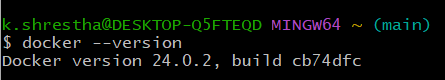
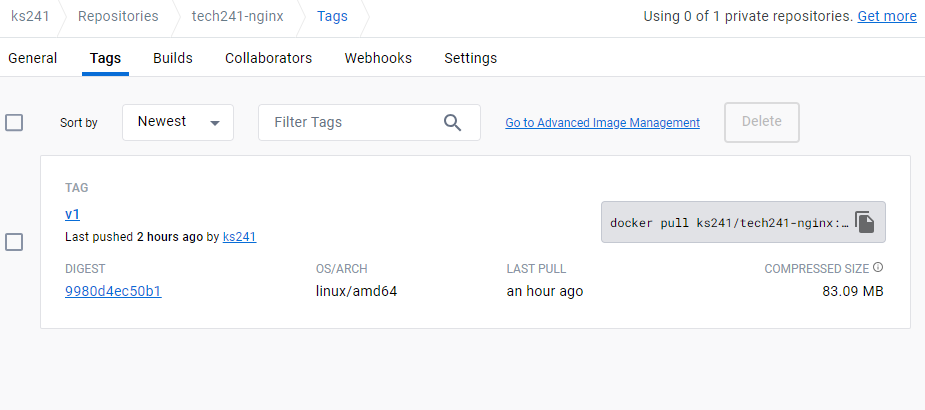

# Installing Docker Desktop 
```
1. Install Docker Desktop on Windows 
```

[Docker Intallation URL](https://docs.docker.com/desktop/install/windows-install/)


``` 
2. Run intaller.exe
```

```
3. Restart computer after running intallation
```

```
4. Open GitBash terminal and check Docker Version 
```

### Command to check Docker Version

`docker --version`



```
5. create a docker hub account using the link below
```
[Docker Hub Account URL](https://login.docker.com/u/login/identifier?state=hKFo2SB0b0Z4T1piY3dReVUwWFlDTU1kVk9yOFV5dGJMM1F4V6Fur3VuaXZlcnNhbC1sb2dpbqN0aWTZIHpMck9zZUFvY0ZocGxQbVlSeDBNVEtwQWI4LVhvNnhio2NpZNkgbHZlOUdHbDhKdFNVcm5lUTFFVnVDMGxiakhkaTluYjk)

```
6. User name: ks21
```

```
7. enable the windows subsystem for linux

dism.exe /online /enable-feature /featurename:Microsoft-Windows-Subsystem-Linux /all /norestart

```

```
8. check requirements for running WSL 2

windows logo key + R

```
```
9. enable virtual machine feature

dism.exe /online /enable-feature /featurename:VirtualMachinePlatform /all /norestart

```

```
10. download the linux kernel update package

wsl.exe --install

wsl.exe --update

```

```
11. set WSL 2 as your default version

wsl --set-default-version 2

```

```
12. ready to open docker

```


# How does docker API work?

Docker API provides a way for external programs and tools to interact with the Docker daemon and manage Docker containers, images, networks, and other resources. 

The API allows developers to automate and integrate Docker functionalities into their own applications, enabling more control and flexibility over Docker operations.


# Docker Introduction commands

### run hello-world
```
docker run hello-world
```

### Check docker processes

```
docker ps
docker ps -a
```

### Run nginx port 80
```
docker run -d -p 80:80 nginx
docker ps
```
### stop container ps
```
docker stop a222aa2d5657
```
## start container ps
```
docker start a222aa2d5657

```

### docker execute container shell and edit
```
docker exec -it a222aa2d5657 sh
```
### Run shahrukh's image 


docker run -d -p 90:80 ahskhan/tech221-nginx:v1
docker ps

### create docker image (commit, push and run)

[Docker commit documention](https://docs.docker.com/engine/reference/commandline/commit/)


```
1. docker commit a222aa2d5657 ks241/tech241-nginx:v1
```
```
2. docker push ks241/tech241-nginx:v1
```
```
3. docker run -d -p 373:80 ks241/tech241-nginx:v1
```
`localhost:373`

### Docker Hub repo


### Docker hub tags



# Create container for Node.js APP

1. CD into your application folder
2. Nano Dockerfile 

```
# Use the official Node.js image as the base image
FROM node:12

# Set the working directory inside the container
WORKDIR /app

# Copy the package.json and package-lock.json files to the container
COPY package*.json ./

# Install app dependencies
RUN npm install

# Copy the rest of the application code to the container
COPY app /app

# Expose the port that the Node.js app is listening on
EXPOSE 3000

# Command to start the Node.js application
CMD ["npm", "start"]


```
3. docker build -t ks241/tech241-nodejs:v1 .
4. docker run -d -p 3000:3000 ks241/tech241-nodejs:v1
5. docker push ks241/tech241-nodejs:v1
6. localhost:3000

