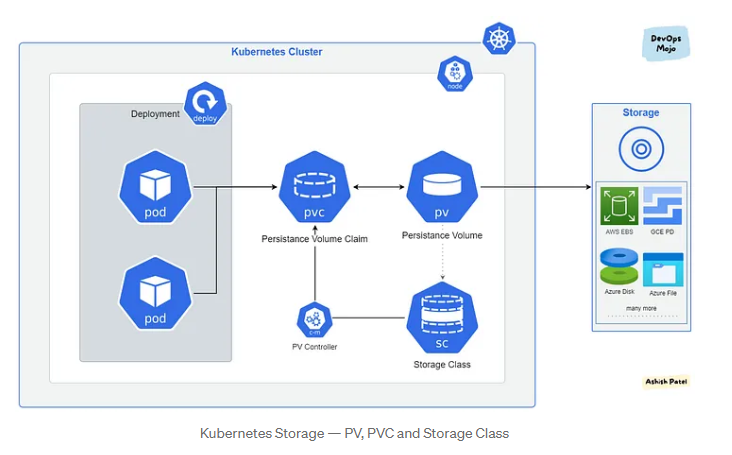

# Kubernetes (K8)

### What is K8?

```
Kubernetes is an open-source container orchestration platform designed to automate the deployment, scaling, and management of containerized applications, making it easier to manage complex microservices-based architectures.
```

### K8 Architecture 


### Why should you learn and use K8?

```
- scaleable and Highly Available 

- excels at managing microservices 

- automation 

- cloud native dev practices

- portable; consistency across env, easy to move applications between cloud providers or on prem.

- large active community for extensive support, documentation and add ons

- industry standard and future proof; widely used by industry, in demand skills and enhaces career prospect.

```

### Who is using K8?
```
- AWS, Azure and Google.

- Apple, Uber, Netflix and VW
```
### benifits to business?

```
Cost Efficiency: 

Faster Deployment: 

Improved Resource Management: Efficiently manage and allocate resources, leading to better utilization and cost savings.

Streamlined Operations: Automate repetitive tasks, reducing manual intervention and freeing up IT teams for higher-value activities.

Enhanced Developer Productivity: Empower developers with a self-service platform, allowing them to focus on coding rather than infrastructure.

Support for Microservices: Facilitate the adoption of microservices architecture, enabling more modular and flexible application development.

Competitive Advantage: Embrace containerization and modern application development practices, staying ahead in the market.

Ecosystem and Support: Benefit from a robust ecosystem, vast community support, and a wide range of tools and integrations.
```

### what are K8 objects - Pods - Deployment/s - Services - replica sets -

```

Pods:

Pods are the smallest deployable units in Kubernetes and represent a single instance of a running process within the cluster.

Deployments:

Deployments are higher-level abstractions that manage the lifecycle of Pods and provide declarative updates for application deployments

Services:

Services provide stable and abstracted endpoints for accessing a set of Pods.

ReplicaSets:

A ReplicaSet is an older version of the Deployment object and is responsible for ensuring a specified number of replicas (Pod instances) are running and maintained.
```

### Concept of labels and selectors in K8
```

Labels are key-value pairs attached to Kubernetes resources like Pods, Services, Deployments, ReplicaSets, etc.


Selectors are used to "select" or filter resources based on their labels

There are two types of selectors:
Equality-Based Selectors: These match resources whose labels have specific key-value pairs.

Set-Based Selectors: These match resources using a set of label requirements (AND, OR, NOT conditions).
```

# Deployment for nginx

### step 1 - Create file yml for nginx
```
nano nginx-k8.yml
```
```
apiVersion: apps/v1 # which api to use for deployment
kind: Deployment # pod - service what kind of service/object you want to create

 

# what would you like to call it - name the service/object
metadata:
  name: nginx-deployment # naming the deployment

 

spec:
  selector:
    matchLabels:
      app: nginx # look for this label to match with k8 service
    # Let's create replica set of this with instances/pods
  replicas: 3 # 3 pods
    # template to use its label for k8 service to launch in the browser
  template:
    metadata:
      labels:
        app: nginx # This label connects to
                   # the service or any other k8 components
  # Let's define the container spec
    spec:
      containers:
      - name: nginx
        image: ks241/tech241-nginx:v2
        ports:
        - containerPort: 80


```

### step 2 create deployment 

```
kubectl create -f nginx-k8.yml

```
### step 3 - check deployment 

```
kubectl get deployment
```

### step 4 - to delete deployment in k8

```
kubectl delete deployment nginx-k8.yml
```

### create yml file for nodejs

```
nodejs-k8.yml

```
```
apiVersion: apps/v1 # which api to use for deployment
kind: Deployment # pod - service what kind of service/object you want to create

 

# what would you like to call it - name the service/object
metadata:
  name: nodejs-deployment # naming the deployment

 

spec:
  selector:
    matchLabels:
      app: nodejs # look for this label to match with k8 service
    # Let's create replica set of this with instances/pods
  replicas: 3 # 3 pods
    # template to use its label for k8 service to launch in the browser
  template:
    metadata:
      labels:
        app: nodejs # This label connects to
                   # the service or any other k8 components
  # Let's define the container spec
    spec:
      containers:
      - name: nodejs
        image: ks241/tech241-nodejs:v1
        ports:
        - containerPort: 3000


```

### step create deployment 

```
kubectl create -f nodejs-k8.yml

```
### step - check deployment 

```
kubectl get deployment
```


# k8 Deployment Architecture


```
Within a cluster i created a delployment from creating a file that codified step. I instructed k8 to create 3 pods with matching selectors and labels.

k8 will create a replica set template for the pod instances associated to the label. Within the replica set you have three pods.
Deleting the delopyment will delete all others includng the pods and replica.

The service will act as a loadbalancer to access the app with the specified port assgined in the service script.

```

### Creating a service.yml

```
 create file nginx-service.yml 
 ```

 ```
---
# Select the type of API version and type of service/object
apiVersion: v1
kind: Service
# Metadata for name
metadata:
  name: nginx-svc
  namespace: default # sre
# Specification to include ports selector to connect to the deployment
spec:
  ports:
  - nodePort: 30001 # range is 30000-32768
    port: 80
    targetPort: 80

# Lets define the selector and label to connect to nginx deployment
  selector:
    app: nginx # this label connects this service to deployment

  # Creating NodePort type of deployment
  type: NodePort # also use LoadBalancer - for local use cluster IP


 ```

 ### create nginx-service command 

```
 kubectl create -f nginx-service.yml
```


### Creating a service for nodejs

```
 create file:  nodejs-service.yml 
 ```

```
---
# Select the type of API version and type of service/object
apiVersion: v1
kind: Service
# Metadata for name
metadata:
  name: nodejs-svc
  namespace: default # sre
# Specification to include ports selector to connect to the deployment
spec:
  ports:
  - nodePort: 30002 # range is 30000-32768
    port: 3000
    targetPort: 3000

 

# Lets define the selector and label to connect to nginx deployment
  selector:
    app: nodejs # this label connects this service to deployment

 

  # Creating NodePort type of deployment
  type: NodePort # also use LoadBalancer - for local use cluster IP
 

```

### check services running 

```
kubectl get svc
```


# Connecting Mongodb to the App


### 1. Dockerfile for mongo 

`nano mongof.conf`

```
# mongod.conf
# Where and how to store data.

storage:
  dbPath: /data/db
  journal:
    enabled: true
  wiredTiger:
    engineConfig:
      cacheSizeGB: 1

# Basic settings
systemLog:
  destination: file
  path: /var/log/mongodb/mongod.log
  logAppend: true

# Network interfaces
net:
  bindIp: 0.0.0.0
  port: 27017

# Security

security:
  authorization: enabled
```

`nano Dockerfile`

```
# Base Image
FROM mongo:3.4

# Set working directory
WORKDIR /data

# Copy the modified configuration file into the Docker image
COPY mongod.conf /etc/mongod.conf


# port mapping
EXPOSE 27017
```

### 2. build container for dockerfile mongo

`docker build -t ks241/tech241-mongodb:v1 .`

### 3. run container for mongo

`docker run -d -p 27017:27017 ks241/tech241-mongodb:v1`

### 4. create delopment for mongo 

```
apiVersion: apps/v1 # which API to use for deployment
kind: Deployment # pod - service what kind of service you want to create
# what would you like to call it - name the service/object
metadata:
  name: mongo # naming the deployment
spec:
  selector:
    matchLabels:
      app: mongo #look for this label to match with k8 service
    # let's create a replica set of this with instances/pods
  replicas: 3 # 3 pods
    # template to use it's label for k8 service to launch in the browser
  template:
    metadata:
      labels:
        app: mongo # this label connects to the service or any other k8 components
  # let's define the container spec
    spec:
      containers:
        - name: mongo
          image: ks241/tech241-mongodb:v1 # use the image that you built
          ports:
            - containerPort: 27017
```

`kubectl create -f mongo-k8.yml`


### 5. check deployment status

`kubectl get deployment`

### 6. create service for mongo

```
apiVersion: v1
kind: Service
metadata:
  name: mongo
spec:
  selector:
    app: mongo
  ports:
    - port: 27017
      targetPort: 27017

```

`kubectl create -f mongo-service.yml`

### 7. check service status

`kubectl get svc`

### 8. edit dockerfile for nodejs 

`nano Dockerfile`

```

# Use the official Node.js image as the base image
FROM node:12

# Set the working directory inside the container
WORKDIR /app

# Copy the package.json and package-lock.json files to the container
COPY package*.json ./

# Install app dependencies
RUN npm install

# Copy the rest of the application code to the container
COPY app /app

# Expose the port that the Node.js app is listening on
EXPOSE 3000

ENV DB_HOST=mongodb://172.17.0.2:27017/posts

# Command to start the Node.js application
CMD ["npm", "start"]

```


### 9. create container for nodejs

`docker build -t ks241/tech241-nodejs:v1 .`

### 10. run container for nodejs app

`docker run -d -p 3000:3000 ks241/tech241-nodejs:v1`

### 11. create nodejs delopment 

```
apiVersion: apps/v1 # which api to use for deployment
kind: Deployment # pod - service what kind of service/object you want to create

 

# what would you like to call it - name the service/object
metadata:
  name: nodejs-deployment # naming the deployment

 

spec:
  selector:
    matchLabels:
      app: nodejs # look for this label to match with k8 service
    # Let's create replica set of this with instances/pods
  replicas: 3 # 3 pods
    # template to use its label for k8 service to launch in the browser
  template:
    metadata:
      labels:
        app: nodejs # This label connects to
                   # the service or any other k8 components
  # Let's define the container spec
    spec:
      containers:
      - name: nodejs
        image: ks241/tech241-nodejs:v1
        ports:
        - containerPort: 3000
        env:
          - name: DB_HOST
            value: mongodb://mongo:27017/posts
        imagePullPolicy: Always
```

`kubectl create -f nodejs-k8.yml`

### 12. check deployment status

`kubectl get deployment`

### 13. create service for nodejs

```
---
# Select the type of API version and type of service/object
apiVersion: v1
kind: Service
# Metadata for name
metadata:
  name: nodejs-svc
  namespace: default # sre
# Specification to include ports selector to connect to the deployment
spec:
  ports:
  - nodePort: 30002 # range is 30000-32768
    port: 3000
    targetPort: 3000

 

# Lets define the selector and label to connect to nginx deployment
  selector:
    app: nodejs # this label connects this service to deployment

 

  # Creating NodePort type of deployment
  type: NodePort # also use LoadBalancer - for local use cluster IP
 
```
`kubectl create -f nodejs-service.yml`

### 14. service status
`kubectl get svc`

### 15. check pods status and extract if for seeding data
`kubectl get pods`

### 16. Ensure the posts page is seeding information 
`kubectl exec nodejs-deployment-6f4f78677f-74glc env node seeds/seed.js`


# Live testing of self healing on k8 (change management)

Pod resources can be terminated to allows K8 to self healing and regenerate the instances.  

### check deployment 
`kubectl get deployment`

### edit deployment (notepad)
`kubectl edit deploy nginx-deployment`

```
Use the notepad editor to make changes to the replica to either increase or decrease the number; save and exit.
```
### check status of deployment

`kubectl get deployment`


# Adding resources:

add script to nodejs deployment 

```
# add resources required 
        resources:
          limits:
            memory: 512Mi
            cpu: "1"
          requests:
            memory: 256Mi
            cpu: "0.2"
```

# HPA Horizontal Pod Autoscaling for either nginx, nodejs or mongo

### create a file for nginx_hpa.yml

```
apiVersion: autoscaling/v1
kind: HorizontalPodAutoscaler #(hpa)

metadata:
  name: nginx-deployment
  namespace: default
  
spec:
  maxReplicas: 9 #(max nuber of instances/pods)
  minReplicas: 3 #(min nuber of instances/pods)
  scaleTargetRef: # Targets the node deployment
    apiVersion: apps/v1
    kind: Deployment
    name: nginx
  targetCPUUtilizationPercentage: 50  # 50% of CPU use

```

### apply the HPA configuration

`kubectl apply -f nginx_hpa.yml`

### monitor HPA
`kubectl get hpa`

# k8 Volumes 

In K8, volumes are used to provide persistent storage to pods. They allow data to survive across pod restarts and help in decoupling storage from the lifecycle of pods. 

### PersistentVolume (PV) and PersistentVolumeClaim (PVC):
PersistentVolumes and PersistentVolumeClaims are used to provide persistent storage that survives across pod restarts and rescheduling. A PersistentVolume (PV) is a cluster-wide resource, while a PersistentVolumeClaim (PVC) is a request for storage by a user. Users request storage by creating a PVC, and Kubernetes dynamically provisions a matching PV to satisfy the claim.



Persistent Volume — low level representation of a storage volume.

Persistent Volume Claim — binding between a Pod and Persistent Volume.

Storage Class — allows for dynamic provisioning of Persistent Volumes.

### PV and PCV for nginx

`nginx-pv.yml`
```
apiVersion: v1
kind: PersistentVolume
metadata:
  finalizers:
  - kubernetes.io/pv-protection
  labels:
    type: local
  name: nginx-pv 
spec:
  accessModes:
  - ReadWriteOnce
  capacity:
    storage: 1Gi
  hostPath:
    path: /tmp/data
    type: ""
  persistentVolumeReclaimPolicy: Retain
  volumeMode: Filesystem


```

`nginx-pvc.yml`
```
apiVersion: v1
kind: PersistentVolumeClaim
metadata:
  name: nginx-pvc
spec:
  accessModes:
    - ReadWriteOnce
  resources:
    requests:
      storage: 1Gi


```

```
# create pv and pvc 

kubectl create -f nginx-pv.yml
kubectl create -f nginx-pvc.yml
kubectl get pv
```