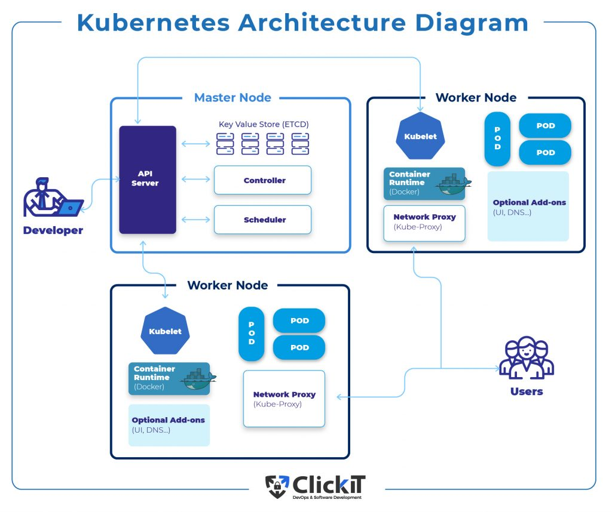

# Kubernetes (K8)

### What is K8?

```
Kubernetes is an open-source container orchestration platform designed to automate the deployment, scaling, and management of containerized applications, making it easier to manage complex microservices-based architectures.
```

### K8 Architecture 



### Why should you learn and use K8?

```
- scaleable and Highly Available 

- excels at managing microservices 

- automation 

- cloud native dev practices

- portable; consistency across env, easy to move applications between cloud providers or on prem.

- latge active community for extensive support, documentation and add ons

- industry standard and future proof; widely used by industry, in demand skills and enhaces career prospect.

```

### Who is using K8?
```
- AWS, Azure and Google.

- Apple, Uber, Netflix and VW
```
### benifits to business?

```
Cost Efficiency: 

Faster Deployment: 

Improved Resource Management: Efficiently manage and allocate resources, leading to better utilization and cost savings.

Streamlined Operations: Automate repetitive tasks, reducing manual intervention and freeing up IT teams for higher-value activities.

Enhanced Developer Productivity: Empower developers with a self-service platform, allowing them to focus on coding rather than infrastructure.

Support for Microservices: Facilitate the adoption of microservices architecture, enabling more modular and flexible application development.

Competitive Advantage: Embrace containerization and modern application development practices, staying ahead in the market.

Ecosystem and Support: Benefit from a robust ecosystem, vast community support, and a wide range of tools and integrations.
```

### what are K8 objects - Pods - Deployment/s - Services - replica sets -

```

Pods:

Pods are the smallest deployable units in Kubernetes and represent a single instance of a running process within the cluster.

Deployments:

Deployments are higher-level abstractions that manage the lifecycle of Pods and provide declarative updates for application deployments

Services:

Services provide stable and abstracted endpoints for accessing a set of Pods.

ReplicaSets:

A ReplicaSet is an older version of the Deployment object and is responsible for ensuring a specified number of replicas (Pod instances) are running and maintained.
```

### Concept of labels and selectors in K8
```

Labels are key-value pairs attached to Kubernetes resources like Pods, Services, Deployments, ReplicaSets, etc.


Selectors are used to "select" or filter resources based on their labels

There are two types of selectors:
Equality-Based Selectors: These match resources whose labels have specific key-value pairs.

Set-Based Selectors: These match resources using a set of label requirements (AND, OR, NOT conditions).
```